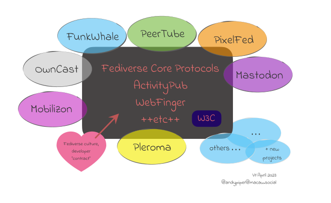

# Fediverse Developer Network
#### Building a Resource for Developers

Background: media/true

---
# Idea

	&nbsp;
	- A resource for developers building new services to integrate with the Fediverse
	&nbsp;
	- A space for developers to share ideas, collaborate on projects, and learn from each other

---
# Three core concepts

	> 1. Developers in the Fediverse should have an easy way to ***find each other*** and ***catch up on what's happening***.
	&nbsp;
	> 2. New developers need a ***resource library of best practices***, emerging concepts, and ***documentation*** to prepare for connecting their apps to a global federated network.
	&nbsp;
	> 3. There needs to be ***a place to publish guides and tools*** that make everyone's lives easier.

---

Discuss this concept from last year
---
## Current Status
	- GitHub org and verified domain
		- `github.com/fediverse-devnet`
	- Website / landing page
		- `fedidevs.org`
		- limited, project-specific docs (to date)

---
## Current Status
	- Discussion spaces
		- `matrix.to/#/#fediverse-devs:matrix.org`
		- `mastodon.social/fedidevs` | `@fedidevs@venera.social` |  `#fedidevs` 
	- Show-and-tell meetings (occasional, so far)
---
## Need to Have / Features

	- More documentation
	- Better navigation and discovery
	- ***A guide to culture / thoughtful integrations***
	- Index to libraries / SDKs?

---
## What Next?

	- Meetup / show-and-tell schedule 
		(top ask at the last meeting)

---
# Get Involved!

	- Visit the Fediverse Developer Network website
	&nbsp;
	- Join us on Matrix
	&nbsp;
	- Follow on Mastodon / Friendica
	&nbsp;
	- Look out for upcoming meet-ups

